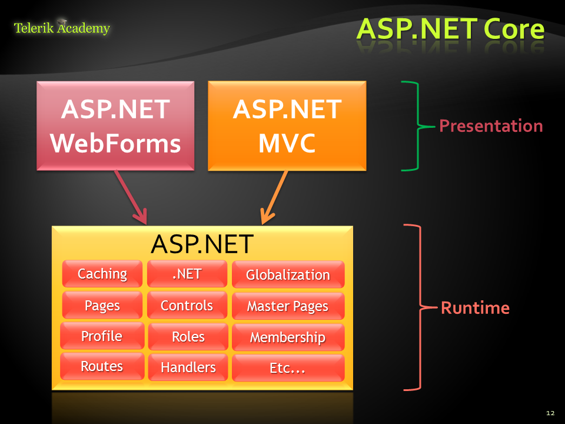

# Similarities and differences between ASP.NET Web Forms and ASP.NET MVC

**ASP.NET Web Forms and ASP.NET MVC share common core runtime.**

**ASP.NET WebForms**

*	Stable and mature, supported by heaps of third party controls and tools
*	Event driven web development
*	Postbacks
*	Viewstate
*	Less control over the HTML
*	Hard to test
*	Rapid development

**ASP.NET MVC**

*	Runs on top of ASP.NET
*	Not a replacement for WebForms
*	Leverage the benefits of ASP.NET
*	Caching, modules, handlers, session state, …
*	Embrace the web
*	User/SEO friendly URLs, clean HTML 5, SPA
*	Adopt REST concepts
*	Uses MVC pattern
*	Conventions and Guidance
*	Separation of concerns
*	Tight control over markup
*	Testable
*	Loosely coupled and extensible
*	Convention over configuration
*	Razor view engine- One of the greatest view engines, with intellisense, integrated in Visual Studio
*	Reuse of current skills (C#, EF, LINQ, JS, etc.)
*	Application-based (not scripts like PHP)
*	Each component has one responsibility
*	Separation of concerns
	*	SRP – Single Responsibility Principle
	*	DRY – Don’t Repeat Yourself
*	More easily testable
	*	TDD – Test-driven development
*	Helps with concurrent development
	*	Performing tasks concurrently
	*	One developer works on views
	*	Another works on controllers
*	Extensible- Replace any component of the system
	*	Interface-based architecture
	*	Almost anything can be replaced or extended
		*	Model binders (request data to CLR objects)
		*	Action/result filters (e.g. OnActionExecuting)
		*	Custom action result types
		*	View engine (Razor, WebForms, NHaml, Spark)
		*	View helpers (HTML, AJAX, URL, etc.)
		*	Custom data providers (ADO.NET), etc.
		*	Controller factory can be also replaced
*	Clean URLS
	*	REST-like
		*	/products/update
		*	/blog/posts/2013/01/28/mvc-is-cool
	*	Friendlier to humans
		*	/product.aspx?catId=123 or post.php?id=123
		*	Becomes /products/chocolate/
	*	Friendlier to web crawlers
		*	Search engine optimization (SEO)

**Advantages of MVC over Web Forms:**

*  The page lifecylce is simpler and more efficient
*  There is no such thing as controls besides html controls. You don't need to debug your output to see what ASP.Net is generating.
*  ViewModels give you immense power and obviate the need to do manual control binding and it eliminates many errors relating to binding.
*  You can have multiple forms on a page. This was a serious limitation of WebForms.
*  The web is stateless and MVC matches the architecture of the web more closely. Webforms introduces state and the bugs you have with it by introducing the ViewState. The ViewState is automatic and works in the background, so it doesn't always behave the way you want it to.
*  Web applications need to work with ajax and sockets these days. It's not acceptable to have full page loads any more. MVC makes ajax so so much better, easier and more efficient with JQuery and sockets with SignalR.
*  Because you can have multiple forms on a page, and because the architecture is driven by calls to urls, you can do funky things like ajax load a different form, like an edit form into your current page using JQuery. Once you realise what this lets you do you can do amazing things easily.
*  ASP.Net WebForms is not only an abstraction over html, it is an extremely complex one. Sometimes you would get a weird bug and struggle with it for much longer than need be. In many cases you could actually see what it was doing wrong but you are unable to do anything about it. You end up doing weird workarounds.
*  WebForms does not make a good technology for designers. Designers often like working with html directly. In MVC it's a view, in WebForms it's half a day of work.
*  As the web platform is evolving fast WebForms wont keep up. It's not aware of new tags or features of HTML5, it will still render the same stuff unless you get (often) expensive 3rd party controls or wait for Microsoft to issue an update.
*  Controls in WebForms limit you in so many ways. In MVC you can just grab a JQuery library and integrate it into your templates.

Reference:
[stackexchange.com](http://programmers.stackexchange.com/questions/95212/when-to-favor-asp-net-webforms-over-mvc#answer-170523)